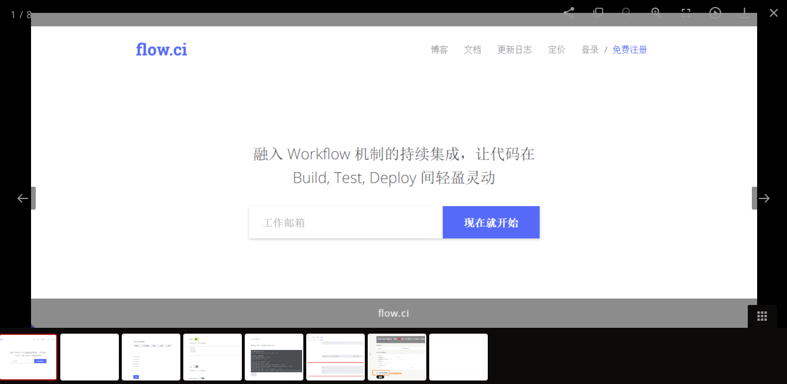

# Astrid

[](https://travis-ci.org/Laueray/hexo-theme-astrid)   [](https://github.com/Laueray/hexo-theme-astrid/blob/master/LICENSE)

A theme for Hexo.

[**在线预览**](http://blog.floretten.com/hexo-theme-astrid/)  |   [**English Documentation**](https://github.com/Laueray/hexo-theme-astrid/blob/master/README.md)


<!--more-->

## 安装步骤

 1. 从 GitHub 上获取主题源码

 ```shell
 $ git clone https://github.com/Laueray/hexo-theme-astrid.git themes/astrid
 ```
 2. 在配置中启用主题

 ```
 # Extensions
 ## Plugins: http://hexo.io/plugins/
 ## Themes: http://hexo.io/themes/
 theme: astrid
 ```
 3. 更新

 ```shell
 $ cd themes/Astrid
 $ git pull
 ```

## 主题配置

### 配置实例

``` yml
# ---------------------------------------------------------------
# 主题信息配置
# ---------------------------------------------------------------

# 标题栏菜单
menu:
  Home: /
  Archives: /archives
  Categories: /categories
  Tags: /tags
  #About: /about

# 网站建立时间
since: 2016

# 设置网站关键词，用于搜索引擎优化 (多个关键词请用英文逗号分隔)
keywords: ""

# 设置网站图标，可以把图标放在 `/themes/astrid/source/` 文件夹下，也可以使用一个网络链接。
# (示例 `http://abc.com/favicon.ico` or `css/images/favicon.ico`)
favicon: css/images/favicon.ico

# 首页文章摘要
auto_excerpt: true

# 文章随机占位图片
random_thumb: true

# 统计文章阅读量，需要注册 leancloud
leancloud_visitors:
  enable: true
  app_id: #app_id
  app_key: #app_key

# 侧边栏挂件
widgets:
- recent_post
- social
- archive
- tagcloud
- category
- recent_comment

# 社交链接
# 键是社交平台名称，值是该平台的个人链接
social:
  Github: https://github.com
  Facebook: https://www.facebook.com
  Google+: https://plus.google.com
  Weibo: http://www.weibo.com

# 代码高亮主题，可选的值有：
# normal | night | night eighties | night blue | night bright
highlight_theme: normal

# 挂件相关
archive_type: 'monthly'
show_count: true

# 文章打赏 (未完成)
reward:
  enable: false
  alipay:
  wechatpay:

# 文章评论，选择一种评论系统即可
duoshuo_shortname: laueray # Enter your duoshuo shortname here.
disqus_shortname: # Enter your duoshuo shortname here.
uyan_id: # Enter your uyan id

# 站长工具的网站验证
google_site_verification:
baidu_site_verification:
qihu_site_verification:

# 网站分析
baidu_analytics:
google_analytics:
gauges_analytics:
tencent_analytics:
tencent_mta:

# 网站分析，Facebook接口
facebook_sdk:
  enable: false
  app_id:       #<app_id>
  fb_admin:     #<user_id>
  like_button:  #true
  webmaster:    #true

# CNZZ 统计
cnzz_siteid:

# Application Insights 性能分析
application_insights:

# 数学公式支持
mathjax:
  enable: false
  per_page: false
```

## 主题特性

### 文章相册

Astrid 使用 [lightgallery.js](https://sachinchoolur.github.io/lightgallery.js/) 来帮助我们浏览图片。



### 侧边栏

Astrid 提供了 6 中侧边栏挂件:

- recent_post  #最近文章
- social  #社交链接
- archive  #文章归档
- tagcloud  #标签云
- category  #文章分类
- recent_comment  #最新评论

这些挂件默认都添加到页面中，你可以在主题配置的 `widget` 选择要添加的挂件。

### 文章评论

Astrid 支持多说/Diqus/友言评论系统，具体可在 `astrid/_config.yml` 中配置:

```yml
# Comments
# Choose only one to display
duoshuo_shortname: laueray # Enter your duoshuo shortname here.
disqus_shortname: # Enter your duoshuo shortname here.
uyan_id: # Enter your uyan id
```

## 浏览器支持


## 贡献项目

欢迎大家提出问题或改进建议，直接提issue或者评论，或者pull request都行，方便一起交流学习。

[Hexo]: https://hexo.io/
[Font Awesome]: http://fontawesome.io/